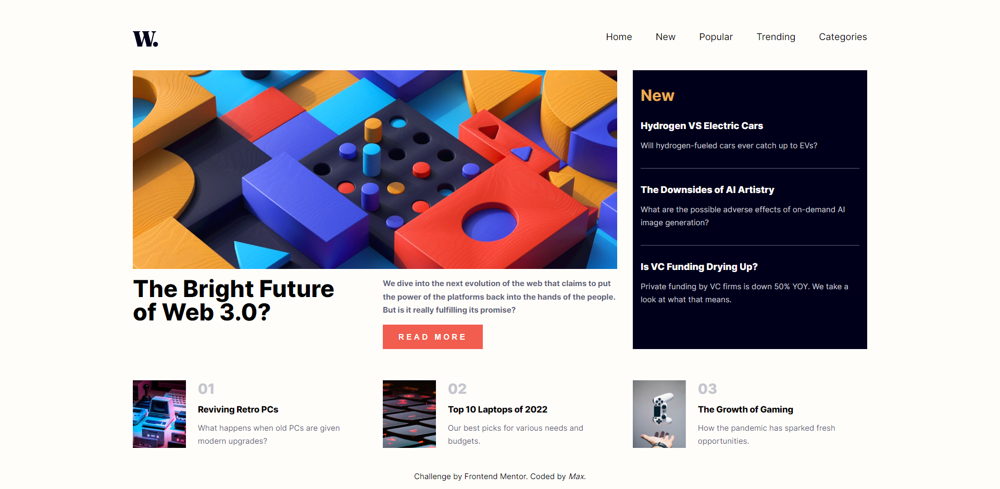
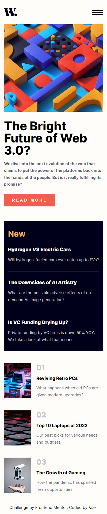
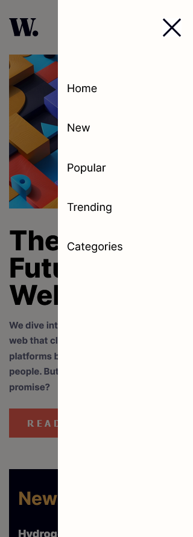

# Frontend Mentor - News homepage
This is a solution to the [News homepage challenge on Frontend Mentor](https://www.frontendmentor.io/challenges/news-homepage-H6SWTa1MFl). Frontend Mentor challenges help you improve your coding skills by building realistic projects. 

# Table of contents
  - [The challenge](#the-challenge)
  - [Screenshots](#screenshots)
  - [Links](#links)
  - [Built with](#built-with)

### The challenge

Users should be able to:

- View the optimal layout for the interface depending on their device's screen size
- See hover and focus states for all interactive elements on the page
- **Bonus**: Toggle the mobile menu (requires some JavaScript)

### Screenshots

## Links
- [Solution](https://www.frontendmentor.io/solutions/bem-sass-flexbox-css-grid-mobilefirst-XLUtWb_4IC)
- Live Site URL: https://news-homepage-gold.vercel.app/

## Built with
- Semantic HTML5 markup
- BEM methodology
- SASS 
- Flexbox
- CSS Grid
- JavaScript
- Mobile-first workflow

## Author
- Frontend Mentor - [@MaxDobisz](https://www.frontendmentor.io/profile/maxdobisz)
- Linkedin - [@MaxDobisz](https://www.linkedin.com/in/maxdobisz/)
